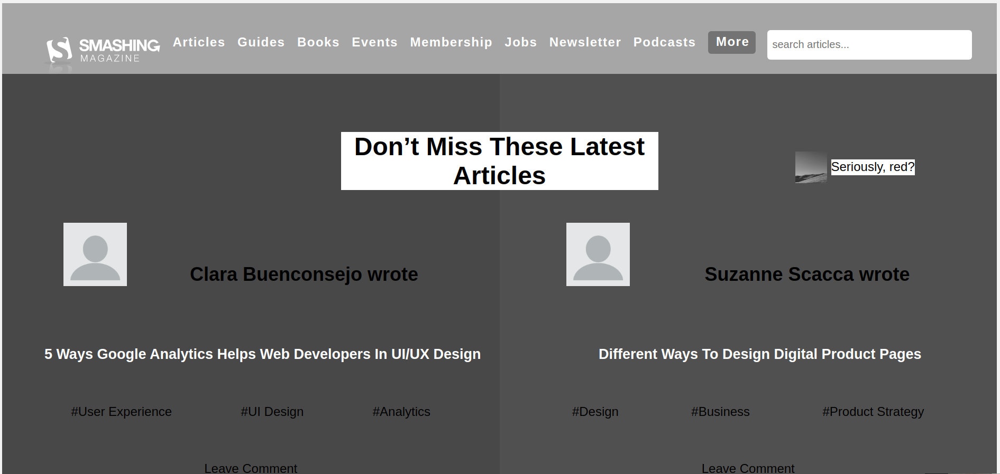

# Smashing Magazine HeatMap - A Microverse Project

A Smashing Magazine HeatMap built for Microverse's UI/UX module.

## Built With

- HTML
- CSS

## Live Demo

[Live Demo Link](https://pointerish.github.io/Design-Teardown-Microverse/)

##  Getting Started

To run the code simply download the repository by either cloning it or 
downloading it as Zip file. Then use the old trustable browser to open the HTML file.

## Authors

**Imran Yousaf**

- GitHub: [@imran5644](https://github.com/imran5644)
- LinkedIn: [Imran Yousaf](https://www.linkedin.com/in/imran-yousaf-8777297b/)

**Josias Alvarado**

- GitHub: [@pointerish](https://github.com/pointerish)
- Twitter: [@pointerish](https://twitter.com/pointerish)
- LinkedIn: [Josias Alvarado](https://www.linkedin.com/in/josias-alvarado-80901878/)

##  Contributing

Contributions, issues, and feature requests are welcome!

## Show your support

Give a ⭐️ if you like this project!

## License

This project is [MIT](./LICENSE) licensed.